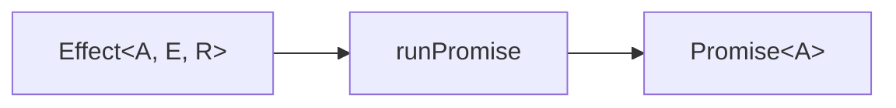

> Placeholder. Real prose lands in `skills-b8j.6`. This file exists so the
> pipeline has something to chew on.

## A description, not a running thing

```ts twoslash
import { Effect } from 'effect'

const program = Effect.succeed(1).pipe(Effect.map((n) => n + 1))
//    ^?
```

Nothing has run yet. To actually execute it:

```ts twoslash
import { Effect } from 'effect'
const program = Effect.succeed(2)
// ---cut---
const result = await Effect.runPromise(program)
```

## The shape of it



## An untagged block

Not every snippet is a compilable file, so untagged blocks are highlighted
only:

```ts
someUndeclaredThing.doesNotExist()
```
