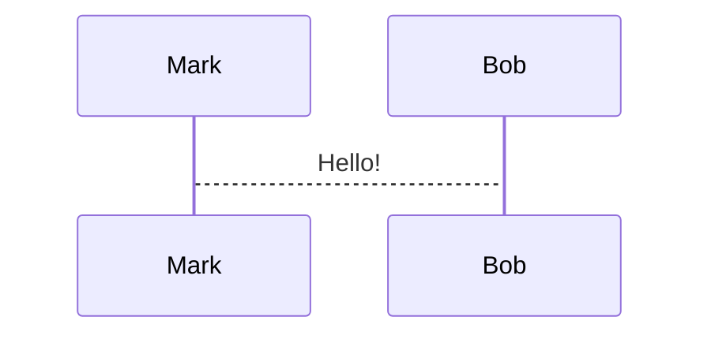

# Code blocks

Attributes go after the language on the opening fence: ```` ```rust +exec +line_numbers ````.

## Highlighting

`+line_numbers` shows line numbers. `+no_background` drops the code background — useful with `+exec_replace`.

Selective highlighting takes lines and ranges in braces; everything else renders dimmed:

~~~markdown
```rust {1,3,5-7}
fn potato() -> u32 {
    println!("hi");
}
```
~~~

Dynamic highlighting splits those groups with `|`, advancing one group per keypress. `all` highlights everything in a frame:

~~~markdown
```rust {1,3|5-7|all}
...
```
~~~

Include an external file with the `file` snippet type — `path` and `language` are required, `start_line`/`end_line` optional:

~~~markdown
```file +exec +line_numbers
path: snippet.rs
language: rust
start_line: 5
end_line: 10
```
~~~

Syntaxes come from [bat](https://github.com/sharkdp/bat). For an unsupported language, shell out to bat instead:

~~~markdown
```bash +exec_replace
bat --color always script.py
```
~~~

### Languages

Highlighting covers ~70 languages. Execution is supported for: bash, cmd, C, C#, C++, elixir, fish, F#, go, haskell, java, javascript, jsonnet, julia, kotlin, lua, nushell, perl, php, powershell, python, R, ruby, rust, shell, typescript, tsx, wsl, zsh. Highlight-only languages include ada, clojure, CSS, dart, docker, elm, erlang, gdscript, graphql, HTML, json, latex, makefile, markdown, nix, ocaml, protobuf, sql, swift, terraform, toml, verilog, vue, xml, yaml, zig. Add your own via `snippet.exec.custom` in `config.yaml`.

## Execution

`+exec` makes a snippet runnable with `<c-e>`; output appears in a box below and persists across slide changes. **Requires `-x` or `snippet.exec.enable: true`.**

~~~markdown
```bash +exec
echo hello world
```
~~~

| attribute | effect |
|---|---|
| `+exec` | run on `<c-e>` |
| `+auto_exec` | run without pressing anything |
| `+exec_replace` | run automatically and replace the snippet with its output (needs `-X`) |
| `+image` | like `+exec_replace`, but the output must be *only* a jpg/png (needs `-X`) |
| `+exec:<executor>` | alternative executor — `rust-script` for rust, `pytest` / `uv` for python |
| `+validate` | not executable, but checked by `--validate-snippets` |
| `+expect:failure` | assert a non-zero exit; error if it succeeds |
| `+id:<name>` | name the snippet so its output can be placed elsewhere |
| `+pty` | run in a pseudo terminal (for `top`, `htop`, anything that moves the cursor) |
| `+pty:<cols>:<rows>` | fixed PTY size |
| `+pty:standby` | reserve and show the PTY area before execution; sized form is `+pty:standby:<cols>:<rows>` |
| `+acquire_terminal` | with `+exec`, suspend presenterm and hand the raw terminal to the program |
| `+render` | pre-render into an image at load time (mermaid, latex, typst, d2) |
| `+width:<n>%` | width of a rendered image, as a percentage of the terminal |

Place output somewhere other than under the snippet with `+id` plus the `snippet_output` command. The snippet runs once no matter how many places reference it, and references must come after it:

~~~markdown
```bash +exec +id:foo
echo hello world
```

<!-- snippet_output: foo -->
~~~

Run presenterm with `--validate-snippets` while writing to execute every `+exec`, `+exec_replace`, and `+validate` snippet at load and on every reload, erroring on non-zero exits.

Escape codes in output are honoured, so force color on tools that auto-disable it (`ls --color=always`).

Hide setup lines from the audience while still executing them, using a per-language prefix — `# ` for rust, `/// ` for python, bash, fish, shell, zsh, kotlin, java, javascript, typescript, c, c++, go:

~~~markdown
```rust +exec
# fn main() {
println!("Hello world!");
# }
```
~~~

> Running someone else's presentation with execution enabled runs their code. `+exec_replace` and `+image` do it without asking.

## Mermaid

Needs [mermaid-cli](https://github.com/mermaid-js/mermaid-cli), which spins up a browser — roughly 2s per diagram, rendered on `snippet.render.threads` threads (default 2).

~~~markdown

~~~

Size via `mermaid.scale` in `config.yaml` first, then `+width` per diagram — a small scale scaled up with `+width` goes blurry. Colors via the theme's `mermaid.background` and `mermaid.theme`. Drop the `+render` requirement per-language with `options.auto_render_languages`.

## LaTeX and typst

`latex` and `typst` blocks with `+render` become images at load time. typst renders both; LaTeX additionally needs [pandoc](https://github.com/jgm/pandoc), which converts it to typst first.

~~~markdown
```latex +render
\[ \sum_{n=1}^{\infty} 2^{-n} = 1 \]
```
~~~

Image resolution is environment-specific, so it lives in `config.yaml` rather than the theme:

```yaml
typst:
  ppi: 400   # default 300
```

Colors and margins do live in the theme:

```yaml
typst:
  colors:
    background: ff0000
    foreground: 00ff00
  horizontal_margin: 2   # points
  vertical_margin: 2
```

Images inside a typst snippet must use absolute paths (`#image("/image1.png")`), resolved relative to the presentation's directory — so the image must sit in that directory or below it.

## D2

Needs [d2](https://github.com/terrastruct/d2) installed, and is slow like mermaid.

~~~markdown
```d2 +render +width:50%
my_table: {
  shape: sql_table
  id: int {constraint: primary_key}
}
```
~~~

Scale with `+width` or `d2.scale` in `config.yaml`; theme with the `d2.theme` theme parameter.
